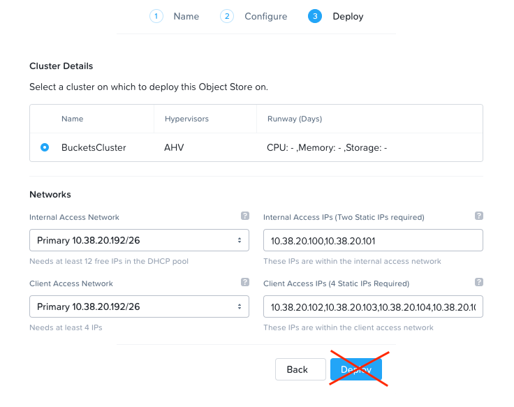

.. _objects_create:

----------------------------------------
Objects: Creating Object Store & Buckets
----------------------------------------

*The estimated time to complete this lab is 60 minutes.*

Overview
++++++++

Data is growing faster than ever before, and much of the new data generated every second is unstructured. Video, backups, images, and e-mail archives are all examples of unstructured data that can cause issues at scale using traditional file and block storage solutions.

Unlike file or block storage, object storage is a data storage architecture designed for unstructured data at the petabyte scale. Object storage manages data as objects, where each object contains the data itself, a variable amount of metadata, and a globally unique identifier. There is no filesystem overhead as there is in block and file storage, so it can be easily scaled out at a global level.

Nutanix Objects is an S3-compatible object storage solution that leverages the underlying Nutanix storage fabric which allows it to benefit from features such as encryption, compression, and erasure coding (EC-X).

Objects allows users to store petabytes of unstructured data on the Nutanix platform, with support for features such as WORM (write once, read many) and object versioning that are required for regulatory compliance, and easy integration with 3rd party backup software and S3-compatible applications.

**What are the use cases for Nutanix Objects?**

- DevOps
    - Single global namespace for multi-geography collaboration for teams spread around the world
    - S3 support
    - Time-to-first-byte of 10ms or less
- Long Term Data Retention
    - WORM compliance
    - Object versioning
    - Lifecycle policies
- Backup Target
    - Support for HYCU and Commvault at GA, with other vendors on the roadmap.
    - Ability to support multiple backup clients simultaneously.
    - Ability to handle really small and really large backup files simultaneously with a key-value store based metadata structure and multi-part upload capabilities.

**In this lab, you will walk through a Nutanix Objects deployment and learn how to create, access, and manage buckets using a popular file transfer application and programmatically via Python.**

Lab Setup
+++++++++

This lab requires applications provisioned as part of the :ref:`windows_tools_vm` **and** :ref:`linux_tools_vm`.

If you have not yet deployed **both** of these VMs, see the linked steps before proceeding with the lab.

**Google Chrome is recommended for this lab.**

Getting Familiar with Object Storage
++++++++++++++++++++++++++++++++++++

An object store is a repository for storing objects. Objects are stored in a flat hierarchy and made up of only 3 attributes - an unique key or identifier, the data itself, and an expandable amount of metadata.  An object store is a single global namespace on which buckets can be created. A bucket can be thought of as similar to a folder in a file storage environment. However, object storage and file storage are very different. Here are some ways object storage and file storage differ.

.. figure:: images/buckets_00.png

Getting Familiar with the Nutanix Objects Environment
+++++++++++++++++++++++++++++++++++++++++++++++++++++

This exercise will familiarize you with the Nutanix Objects environment. You will learn:

- What constitutes the Microservices Platform (MSP) and the services that make up Nutanix Objects.
- How to deploy an Object Store

View the Object Storage Services
................................

#. Login into your Prism Central instance.

#. In Prism Central, select :fa:`bars` **> Services > Objects**.

   View the existing Object Stores. You will be using the **ntnx-objects** Object Store throughout this lab.

#. Select :fa:`bars` **> Virtual  > VMs**.

   For the lab deployment, you will see 2 VMs, each preceded with the name of the object store.

   .. note:: In a production environment, there would be at a least 5 VMs - 3 worker VMs (default) and 2 load balancers (envoy). In Medium and Large deployments there would be additional worker and load balancer VMs.

   For example, if the name of the object store is **ntnx-objects**, there will be a VM with the name **ntnx-objects-envoy-1**.

   +----------------+-------------------------------+---------------------+
   |  VM            |  Purpose                      |  vCPUs  |  Memory   |
   +================+===============================+=====================+
   |  default-0     |  Kubernetes Node              |  10     |  32 GiB   |
   +----------------+-------------------------------+---------------------+
   |  envoy-0       |  Load Balancer / Endpoint     |  2      |  4 GiB    |
   +----------------+-------------------------------+---------------------+

  These VMs are deployed by the Microservices Platform (MSP), the Kubernetes-based platform on which multiple future Nutanix services will be run. The service that controls the MSP runs on Prism Central.

   The **default** VMs run the Kubernetes cluster. The Kubernetes cluster consists of one or more master nodes, which provides the control plane for the Kubernetes cluster, as well as worker nodes. Kubernetes runs in multi-master mode, which allows for any node to become the master if needed.

   These nodes run etcd, which is a Kubernetes-level distributed key-value store for storing and replicating the Kubernetes-cluster level metadata. The nodes also run the object store components. This includes:

   - S3 adapter - Translates the S3 language into the internal system language
   - Object controller - Handles all the I/O
   - Metadata service - Distributed key-value store to provide consistency across a massive object store deployment
   - Atlas service - Handles garbage collection and enforces policies such as life cycle management, versioning, and WORM
   - UI gateway - this is the endpoint for all UI requests, handles bucket management, stats display, user management interface, etc
   - Zookeeper - Manages the configuration for the object storage cluster
   - IAM service - Handles user authentication for accessing buckets and objects

   The envoy VMs provide load balancing across the object controller components. The IP address of these VMs are the IP that can be used by clients to access the object store. It is the first point of entry for an object request (for example, an S3 GET or PUT). It then forwards this request to one of the worker VMs (specifically, the S3 adapter service running as part of the object-controller pod).

Walk Through the Object Store Deployment
........................................

In this exercise you will walk through the steps of creating an Object Store. **You will not actually deploy the Object Store, but you will be able to see the workflow and how simple it is for users to deploy an Object Store.**

.. note::

  In many use cases only a single object store is required. If global namespace isolation is required, for example if a Service Provider is providing object storage to multiple customers from the same cluster, then multiple object stores can be created.

#. In :fa:`bars` **> Services > Objects**, click **Create Object Store**.

   .. figure:: images/buckets_01.png

#. Review the prerequisites and click **Continue**.

#. Fill out the following fields:

   - **Object Store Name** - *initials*-oss
   - **Domain**  - ntnxlab.com

   .. figure:: images/buckets_02.png

#. Click **Next**.

   Next you will be able to configure the capacity of your object store.

   The chosen option determines how many nodes will be deployed and the size of each.

   .. note::

     Note that although a storage capacity is defined here, it is not a hard limit. Storage capacity is limited only by the license and the available storage capacity of the cluster.

   Select the different options (Small, Medium, Large) and notice how the Resource numbers change. These are the resources that will be applied across the K8s worker VMs. For example, specifying 30vCPU and 72GB of RAM across 3 workers, comes to 10 vCPU and 24 GB of RAM per worker. Custom values are also allowed.

#. Select Small (50TiB), and click **Next**.

   .. figure:: images/buckets_03.png

   On the final screen, you will see the clusters managed by Prism Central.

   .. note::

     To help validate that the Object Store is being deployed in the proper cluster, administrators can easily see the CPU, Memory, and Storage runways for each of the clusters.

#. Select the assigned cluster and note the expanded Network dialog.

   **Internal Access Network:** This is the network where the MSP VMs will communicate, which requires 18 IP addresses to be reserved (for scale out). Select the **Primary** Network.

   **Internal Access IPs:** These are additional IPs for internal communication and are required to be static. Two static IPs are required.

   **Client Access Network:** This is the network for client access. This network can be the same as the Infrastructure Network.

   **Client Access IPs:** These are the endpoint IPs that the external applications will connect to. 4 static IPs are required.

.. raw:: html

  <strong>Close the Create Object Store wizard, do NOT click Deploy.</strong>

#. On the main Objects UI, take a note of the IP address in the **Client Used IPs** column for the existing object store, as it will be used in a future lab.

Walk through Bucket Creation and Policies
.........................................

A bucket is a sub-repository within an object store which can have policies applied to it, such as versioning, WORM, etc. By default a newly created bucket is a private resource to the creator. The creator of the bucket by default has read/write permissions, and can grant permissions to other users.

#. Click the **Name** of the existing Object Store (**NAME?**) to manage it.

#. Click **Create Bucket**, and fill out the following fields:

   - **Name**  - *your-name*-my-bucket
   - **Enable Versioning** - Checked

   .. figure:: images/buckets_05.png

#. Click **Create**.

   .. note:: Buckets created via Prism Central are owned by the Prism Central admin.

   If versioning is enabled, new versions can be uploaded of the same object for required changes, without losing the original data.

   Lifecycle policies define how long to keep data in the system.

   Once the bucket is created, it can be configured with WORM.

   WORM (Write Once, Read Many) storage prevents the editing, overwriting, renaming, or deleting data and is crucial in heavily regulated industries (finance, healthcare, public agencies, etc.) where sensitive data is collected and stored. Examples include e-mails, account information, voice mails, and more.

   .. note::

     Note that if WORM is enabled on the bucket, this will supersede any lifecycle policy.

#. Check the box next to your *your-name*-**my-bucket** bucket, and click **Configure WORM**. Note you have the ability to define a WORM data retention period on a per bucket basis.

#. Check the box next to your *your-name*-**my-bucket** bucket, and click **Share**.

   This is where you will be able to share your bucket with other users. You can configure read access (download), write access (upload), or both, on a per user basis. Since we haven't created any users yet, just click **Cancel**.

   .. figure:: images/buckets_share.png

User Management
+++++++++++++++

In this exercise you will create generate your access and secret key to access the object store, that will be used throughout the lab.

#. From the Buckets UI, click on **Access Keys** and click **Add People**.

   .. figure:: images/buckets_add_people.png

#. Select **Add people not in Active Directory** and enter your e-mail address.

   .. figure:: images/buckets_add_people2.png

#. Click **Next**.

#. Click **Download Keys** to download a .csv file containing the **Access Key** and **Secret Key**.

   .. figure:: images/buckets_add_people3.png

#. Click **Close**.

#. Open the file with a text editor.

   .. figure:: images/buckets_csv_file.png

   .. note::

     Keep the text file open so that you have the access and secret keys readily available for future labs.

Takeaways
+++++++++

What are the key things you should know about **Nutanix Objects**?

- Nutanix Objects will be enabled and deployed from Prism Central.

- A 2TiB Objects license is included with every AOS cluster. After that, it is licensed by used capacity (as opposed to number of nodes).

- Nutanix Objects can be deployed on an AHV cluster, with ESXi support on the roadmap.
